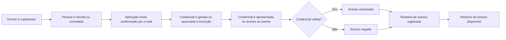

# CRUDential

Crudential é um projeto de estudo e portfólio pessoal construído como uma API REST para gestão de eventos, participantes e credenciais de acesso.

O objetivo da aplicação é apoiar um fluxo básico de cadastro de pessoas em eventos, envio de e-mails de confirmação, validação de credenciais e registro de acesso. A implementação será evoluída de forma incremental, com atenção especial à documentação arquitetural e ao uso de IA como apoio no planejamento, desenvolvimento e revisão.

## Contexto do domínio

A aplicação deve trabalhar com conceitos como eventos, participantes, inscrições, confirmações, credenciais e registros de acesso. Em linhas gerais, o fluxo esperado é:

1. Um evento é cadastrado.
2. Uma pessoa é inscrita ou convidada para o evento.
3. A aplicação envia uma confirmação por e-mail.
4. Uma credencial é gerada ou associada à inscrição.
5. A credencial é validada no momento de acesso ao evento.
6. A tentativa de acesso é registrada.

Esses conceitos ainda podem evoluir conforme a modelagem avançar, mas servem como base para orientar as próximas decisões.

## Direção arquitetural

As principais decisões técnicas estão registradas em ADRs na pasta `docs/`.

Decisões já documentadas:

- Rails API-only como base da aplicação.
- PostgreSQL como banco principal.
- RSpec como estratégia de testes.
- Service Objects para organizar regras de negócio.
- JWT para autenticação stateless.
- Active Job e Solid Queue para jobs assíncronos.
- Docker e Docker Compose para containerização.

Também há um documento de contexto para agentes de IA em `docs/contexto-para-agentes-ia.md`, usado para manter coerência entre documentação, implementação futura e decisões arquiteturais.

## Estado do projeto

Este repositório está em fase inicial. A prioridade neste momento é documentar bem o problema, o domínio e as decisões arquiteturais antes de avançar na implementação.

Detalhes de setup, execução, testes e operação serão adicionados quando estiverem implementados e validados no projeto.
