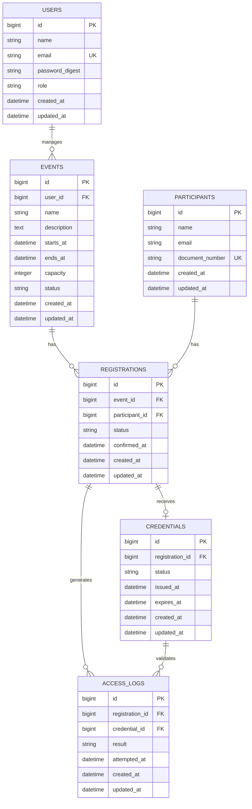

```mermaid
erDiagram
    USERS ||--o{ EVENTS : manages
    EVENTS ||--o{ REGISTRATIONS : has
    PARTICIPANTS ||--o{ REGISTRATIONS : has
    REGISTRATIONS ||--o| CREDENTIALS : receives
    REGISTRATIONS ||--o{ ACCESS_LOGS : generates
    CREDENTIALS ||--o{ ACCESS_LOGS : validates

    USERS {
        bigint id PK
        string name
        string email UK
        string password_digest
        string role
        datetime created_at
        datetime updated_at
    }

    EVENTS {
        bigint id PK
        bigint user_id FK
        string name
        text description
        datetime starts_at
        datetime ends_at
        integer capacity
        string status
        datetime created_at
        datetime updated_at
    }

    PARTICIPANTS {
        bigint id PK
        string name
        string email
        string document_number UK
        datetime created_at
        datetime updated_at
    }

    REGISTRATIONS {
        bigint id PK
        bigint event_id FK
        bigint participant_id FK
        string status
        datetime confirmed_at
        datetime created_at
        datetime updated_at
    }

    CREDENTIALS {
        bigint id PK
        bigint registration_id FK
        string status
        datetime issued_at
        datetime expires_at
        datetime created_at
        datetime updated_at
    }

    ACCESS_LOGS {
        bigint id PK
        bigint registration_id FK
        bigint credential_id FK
        string result
        datetime attempted_at
        datetime created_at
        datetime updated_at
    }
```
